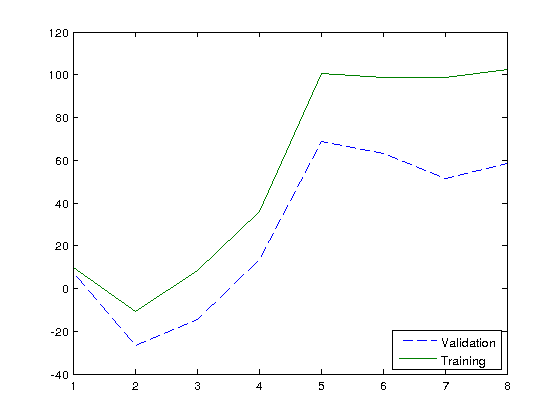
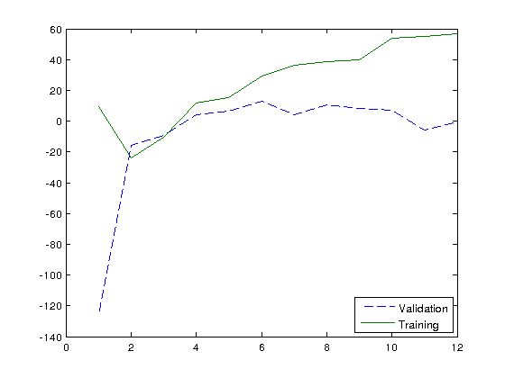

% CSC 321 - Assignment 3
% Zeeshan Qureshi (997108954)
% 19 Mar 2013

Part 1 - Fitting Gaussians
==========================

As can be seen in the figure, the gaussians had the highest validation
and training probability when *Gaussians = 5*. As the validation prob
rises till *5* and then starts to go down but the training probability
stays up means that the model is overfitting.

Be decreasing the standard deviation of the data, with lower gaussians
they do not tend to move at all. Thus the standard deviation is
affecting the maximum step size on each iteration.

\

 Gaussians    Validation Prob    Training Prob
-----------  -----------------  ---------------
    1           7.9600             9.9341
    2           -26.8657           -10.5470
    3           -14.4738           8.3459
    4           13.5253            36.02819
    5           68.7349            100.6420
    6           63.1940            98.7709
    7           51.6067            98.9465
    8           58.3877            102.3457

Part 2 - Reduce Data
====================

We see that training probability rises but validation probability stays
pretty much zero all the time. This shows that there is *not enough
data* to fit the model properly.

\

 Gaussians    Validation Prob    Training Prob
-----------  -----------------  ---------------
    1           -125.8333          9.6329
    2           -15.6033           -23.7722
    3           -9.5407            -10.7525
    4           4.3274             11.5176
    5           6.56899            15.1013
    6           12.7019            29.3574
    7           4.37568            36.1302
    8           10.3104            38.5686
    9           8.02415            40.0637
    10          6.90185            53.9130
    11          -6.0408            55.1076
    12          -0.4819            55.1076

Part 3 - Mixing Proportions
===========================

      Proportion                   Result             Validation Prob    Training Prob
------------------------  -------------------------  -----------------  ---------------
 [0.25 0.25 0.25 0.25]    [59.68 9.78 16.68 13.87]      463.62440         468.65918
 [0.3 0.2 0.2 0.3]        [16.68 13.87 9.78 59.68]      463.62440         468.65918
 [0.2 0.3 0.3 0.2]        [9.78 16.68 59.68 13.87]      463.62440         468.65918
 [0.9 0.05 0.025 0.025]   [31.45 28.95 29.52 10.07]     473.52365         478.62364

